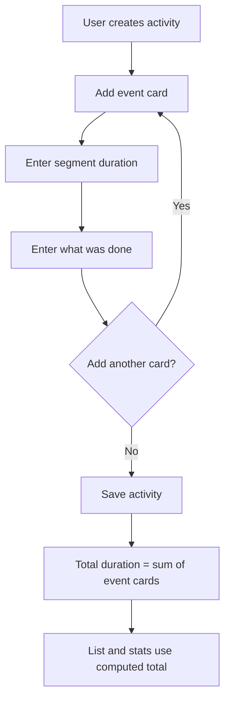

## Why

Requiring one exact duration at activity creation does not match how work actually happens in chunks. Letting users add multiple event cards with duration and detail produces more accurate totals and clearer activity history.

## What Changes

- Replace single duration input on activity creation with user-added event cards.
- Require each event card to include duration and a short description of what was done.
- Compute each activity total duration as the sum of all event-card durations.
- Show event-card details in activity cards so users can review exactly where time was spent.
- Keep list and statistics calculations based on computed totals from event cards.

## Capabilities

### New Capabilities
- `deferred-duration-capture`: Support creating activities with event cards where total duration is derived from card durations rather than a top-level duration input.
- `work-hour-notes`: Capture and display detailed per-event descriptions that explain what work was performed during each time segment.

### Modified Capabilities
- None.

## Impact

- Affected form flow: src/components/TimeEntryForm.js, src/components/TimeEntryForm.css.
- Affected entry editing/display: src/components/TimeList.js, src/components/TimeList.css.
- Affected state and normalization: src/App.js.
- Affected calculations from derived durations: src/components/Statistics.js.
- No backend/API changes and no external dependencies required.

## Flow Diagram

